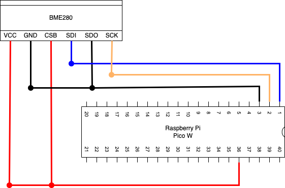

# BME280を使って温度、湿度、気圧を計測

## 仕様

このアプリでは、BME280を使って以下を計測する。

- 温度
- 湿度
- 気圧

### 温度、湿度、気圧

BME280で測定する。

## 回路設計

### Raspberry Pi Pico W

| 端子番号 | 端子名   | 今回の用途            |
| -------- | -------- | --------------------- |
| 1        | I2C0_SDA | SDA                   |
| 2        | I2C0_SCL | SCL                   |
| 3        | GND      | GND                   |
| 36       | 3V3      | BME280やSSD1306の電源 |

### BME280

温湿度・気圧センサー。
温度を-40℃〜85℃、湿度を0%〜100%、気圧を300hpa〜1100hpaの範囲で計測できる。
通信方式は、I2CとSPI通信の２つが使える。

| 端子番号 | 端子名 | I2Cでの用途                           |
| -------- | ------ | ------------------------------------- |
| 1        | VDD    | 電源                                  |
| 2        | GND    | GND                                   |
| 3        | CSB    | 常に電源に接続                        |
| 4        | SDI    | SDA                                   |
| 5        | SDO    | I2Cアドレス選択 (GND:0x76, 電源:0x77) |
| 6        | SCK    | SCL                                   |

## 開発環境

### IDE

Thonnyを使用。

### 使用言語

MicroPython(Raspbery Pi Pico)

### 使用ライブラリ

使用したライブラリは以下の通り

- picozero
- micropython_bme280
