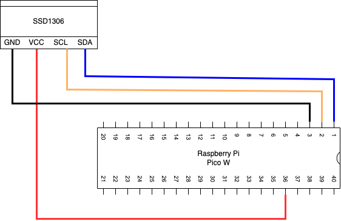

# SSD1306を使って画面表示する

## 仕様

SSD1306を使って画面表示する

## 回路設計

### Raspberry Pi Pico W

| 端子番号 | 端子名   | 今回の用途    |
| -------- | -------- | ------------- |
| 1        | I2C0_SDA | SDA           |
| 2        | I2C0_SCL | SCL           |
| 3        | GND      | GND           |
| 36       | 3V3      | SSD1306の電源 |

### SSD1306

グラフィックディスプレイ。
横128ドット、縦64ドットの解像度で単色表示可能。
通信方式は、I2Cが使える。

| 端子番号 | 端子名 | I2Cでの用途 |
| -------- | ------ | ----------- |
| 1        | GND    | GND         |
| 2        | VCC    | 電源        |
| 3        | SCL    | SCL         |
| 4        | SDA    | SDA         |

## 開発環境

### IDE

Thonnyを使用。

### 使用言語

MicroPython(Raspbery Pi Pico)

### 使用ライブラリ

使用したライブラリは以下の通り

- micropython_ssd1306
