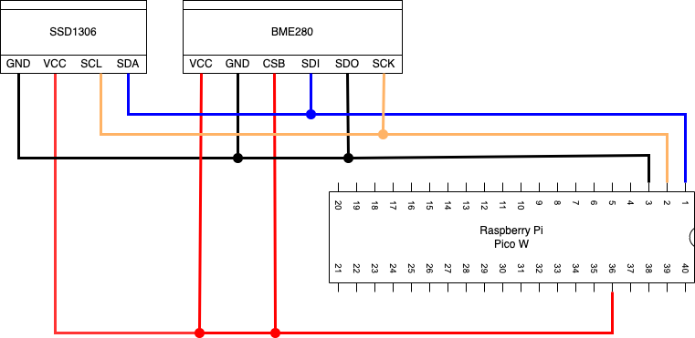

# 温度、湿度、気圧を計測し画面に表示するサンプル

## 仕様

このアプリでは、以下情報を画面に表示する。
かつ、定期的にambientへ以下情報を送信し記録する。

- 温度
- 湿度
- 気圧
- 不快指数
- 不快指数から想定される肌感覚

### 温度、湿度、気圧

BME280で測定する。

### 不快指数の計算式と肌感覚との関係

不快指数は温度と湿度から、以下計算式で求める。

```
不快指数 = 0.81 * 温度 + 0.01 * 湿度 * (0.99 * 温度 - 14.3) + 46.3
```

不快指数から肌感覚を求めるのは下表との通りとする。

| 不快指数             | 肌感覚           |
| -------------------- | ---------------- |
| 不快指数＜ 55        | 寒い             |
| 55 <= 不快指数 ＜ 60 | 肌寒い           |
| 60 <= 不快指数 ＜ 65 | 何も感じない     |
| 65 <= 不快指数 ＜ 70 | 快い             |
| 70 <= 不快指数 ＜ 75 | 暑くない         |
| 75 <= 不快指数 ＜ 80 | やや暑い         |
| 80 <= 不快指数 ＜ 85 | 暑くて汗が出る   |
| 85 <= 不快指数       | 暑くてたまらない |


## 回路設計




### Raspberry Pi Pico W

| 端子番号 | 端子名   | 今回の用途            |
| -------- | -------- | --------------------- |
| 1        | I2C0_SDA | SDA                   |
| 2        | I2C0_SCL | SCL                   |
| 3        | GND      | GND                   |
| 36       | 3V3      | BME280やSSD1306の電源 |

### BME280

温湿度・気圧センサー。
温度を-40℃〜85℃、湿度を0%〜100%、気圧を300hpa〜1100hpaの範囲で計測できる。
通信方式は、I2CとSPI通信の２つが使える。

| 端子番号 | 端子名 | I2Cでの用途                           |
| -------- | ------ | ------------------------------------- |
| 1        | VDD    | 電源                                  |
| 2        | GND    | GND                                   |
| 3        | CSB    | 常に電源に接続                        |
| 4        | SDI    | SDA                                   |
| 5        | SDO    | I2Cアドレス選択 (GND:0x76, 電源:0x77) |
| 6        | SCK    | SCL                                   |

### SSD1306

グラフィックディスプレイ。
横128ドット、縦64ドットの解像度で単色表示可能。
通信方式は、I2Cが使える。

| 端子番号 | 端子名 | I2Cでの用途 |
| -------- | ------ | ----------- |
| 1        | GND    | GND         |
| 2        | VCC    | 電源        |
| 3        | SCL    | SCL         |
| 4        | SDA    | SDA         |

## 開発環境

### IDE

Thonnyを使用。

### 使用言語

MicroPython(Raspbery Pi Pico)

### 使用ライブラリ

使用したライブラリは以下の通り

- micropython_ssd1306
- micropython_bme280

### WIFI接続情報

WIFI接続情報は、`config.py`の以下２変数で設定する。

```python
# WIFI Setting
wifi_ssid = 'MY_WIFI_SSID'  # WIFIのSSID
wifi_pass = 'MY_WIFI_PASSWORD' # WIFIのパスワード
```

### Ambient接続情報

Ambient接続情報は、`config.py`の以下２変数で設定する。

```python
# Ambient Setting
ambient_chid = 'MY_AMBIENT_CHID' # AmbientのチャネルID
ambient_wkey = 'MY_AMBIENT_WKEY' # Ambientのライトキー
```

## Ambientの設定

Ambientの項目には下表のように情報が登録される

| Ambientの項目 | 登録される値 |
| ------------- | ------------ |
| d1            | 温度         |
| d2            | 湿度         |
| d3            | 気圧         |
| d4            | 不快指数     |
| d5            | 肌感覚       |
