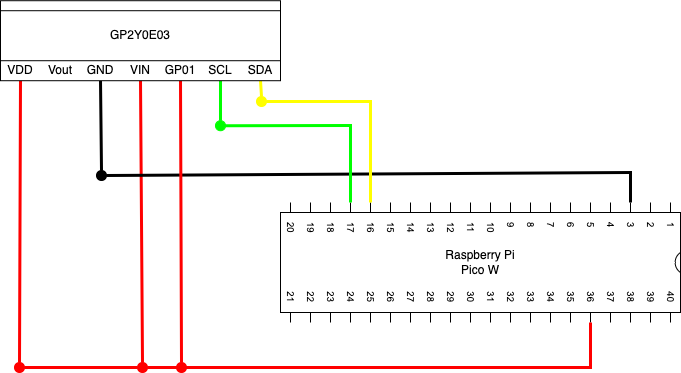

# 赤外線距離センサーを使った距離測定

## 仕様

赤外線距離センサーを使って距離を測定する。

### 距離

GP2Y0E03で測定する。

## 回路設計

### Raspberry Pi Pico W

| 端子番号 | 端子名   | 今回の用途            |
| -------- | -------- | --------------------- |
| 3        | GND      | GND                   |
| 16       | I2C0_SDA | SDA                   |
| 17       | I2C0_SCL | SCL                   |
| 36       | 3V3      | BME280やSSD1306の電源 |

### GP2Y0E03

赤外線距離センサー。
4~50cmの範囲で距離測定が可能。
通信方式は、I2Cとアナログ通信の２つが使える。

| 端子番号 | 線の色 | I2Cでの用途          |
| -------- | ------ | -------------------- |
| 1        | 赤     | 電源                 |
| 2        | 白     | 出力（電圧変化）     |
| 3        | 黒     | GND                  |
| 4        | 橙     | I/O電圧              |
| 5        | 紫     | アクティブの切り替え |
| 6        | 緑     | I2CのSCL             |
| 7        | 黄     | I2CのSDA             |

## 開発環境

### IDE

Thonnyを使用。

### 使用言語

MicroPython(Raspbery Pi Pico)
