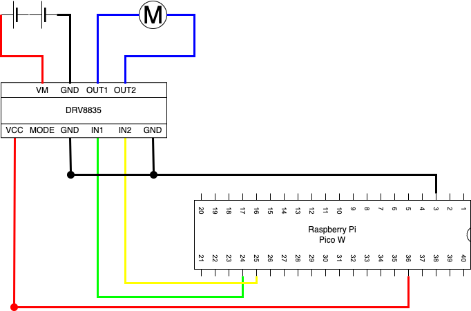

# DCモータードライブモジュールを使ったモーター制御

## 仕様

DCモータードライブモジュールを使ってモーターの動きを制御する。

### DCモータードライブモジュール

DRV8835を使ってモーターを制御する

## 回路設計

### Raspberry Pi Pico W

| 端子番号 | 端子名 | 今回の用途            |
| -------- | ------ | --------------------- |
| 3        | GND    | GND                   |
| 24       | GP18   | IN1                   |
| 25       | GP19   | IN2                   |
| 36       | 3V3    | BME280やSSD1306の電源 |

### DRV8835

DCモータードライバ。

*チャンネル１*
| 端子番号 | 名称 | 用途                         |
| -------- | ---- | ---------------------------- |
| 1        | VCC  | ロジック電源＋（２Ｖ～７Ｖ） |
| 2        | MODE | モード設定                   |
| 3        | GND  | ロジック電源－               |
| 4        | IN1  | 入力１／ＰＨＡＳＥ           |
| 5        | IN2  | 入力２／ＥＮＡＢＬ           |
| 6        | GND  | ロジック電源－               |

*チャンネル２*
| 端子番号 | 名称 | 用途                         |
| -------- | ---- | ---------------------------- |
| 1        | VM   | モータ電源＋（２Ｖ～１１Ｖ） |
| 2        | GND  | モータ電源－                 |
| 3        | OUT1 | モータ出力１                 |
| 4        | OUT2 | モータ出力２                 |

## 開発環境

### IDE

Thonnyを使用。

### 使用言語

MicroPython(Raspbery Pi Pico)
