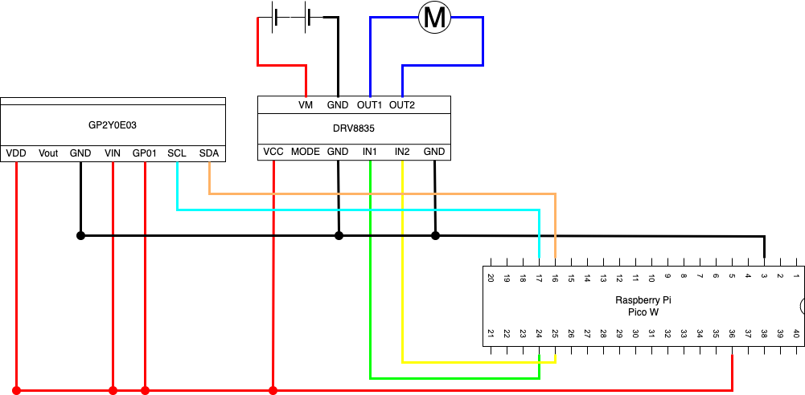

# 距離に応じてモーターをPWM制御する

## 仕様

赤外線距離センサーで前方障害物との距離を計測し、DCモーターをブレーキ制御する。
DCモーターの制御にはPWM制御をモーターの回転速度を疑似的に制御する。

### DCモータードライブモジュール

DRV8835を使ってモーターを制御する

## 回路設計

### DRV8835

DCモータードライバ。

*チャンネル１*
| 端子番号 | 名称 | 用途                         |
| -------- | ---- | ---------------------------- |
| 1        | VCC  | ロジック電源＋（２Ｖ～７Ｖ） |
| 2        | MODE | モード設定                   |
| 3        | GND  | ロジック電源－               |
| 4        | IN1  | 入力１／ＰＨＡＳＥ           |
| 5        | IN2  | 入力２／ＥＮＡＢＬ           |
| 6        | GND  | ロジック電源－               |

*チャンネル２*
| 端子番号 | 名称 | 用途                         |
| -------- | ---- | ---------------------------- |
| 1        | VM   | モータ電源＋（２Ｖ～１１Ｖ） |
| 2        | GND  | モータ電源－                 |
| 3        | OUT1 | モータ出力１                 |
| 4        | OUT2 | モータ出力２                 |

## GP2Y0E03

赤外線距離センサー。
4~50cmの範囲で距離測定が可能。
通信方式は、I2Cとアナログ通信の２つが使える。

| 端子番号 | 線の色 | I2Cでの用途          |
| -------- | ------ | -------------------- |
| 1        | 赤     | 電源                 |
| 2        | 白     | 出力（電圧変化）     |
| 3        | 黒     | GND                  |
| 4        | 橙     | I/O電圧              |
| 5        | 紫     | アクティブの切り替え |
| 6        | 緑     | I2CのSCL             |
| 7        | 黄     | I2CのSDA             |

## 開発環境

### IDE

Thonnyを使用。

### 使用言語

MicroPython(Raspbery Pi Pico)
